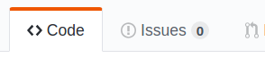
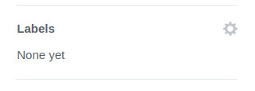
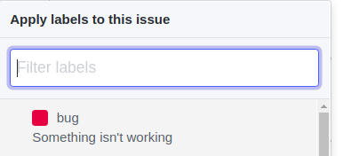
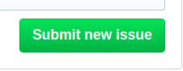
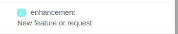

# Contributing

Thanks for joining the Volentix community!

## Table of Contents

- [Code Of Conduct](https://github.com/Volentix/documentation/blob/master/CODE_OF_CONDUCT.md)

<!-- toc -->

- [About](#about)
- [Escalation](#escalation)
- [Communication](#communication)
- [Contributing](#contributing)
  * [Report A Bug](#report-a-bug)
    + [Warning](#warning)
    + [Process](#process-1)
  * [Suggest A Feature](#suggest-a-feature)
    + [Process](#process-2)
  * [Pull Request](#pull-request)
    + [Process](#process)
- [Collect Your VTX](#collect-your-vtx)
  * [Setting A Value](#setting-a-value)

<!-- tocstop -->

## About

The following provides guidance on the processes for:
1. Contributing to Volentix
2. Remuneration of effort

## Escalation

In the event that you are not satisfied as a contributor, please send a message to arbitrator@volentix.io

In the message, please provide as much information as possible. You will recieve a reply from the arbitrator within 48 hrs.

## Communication

Each project is expected to manage their own communications, repositories and platform. Please see that project's CONTRIBUTING.md file for specifics. If the project does not list a communication channel, please escalate using the [Escalation](#escalation) process above.

## Contributing

Developers can contribute in the following ways:

1. Report A Bug
2. Suggest A Feature
3. Pull Request

### Report A Bug

See something, say something. Filing bugs are helpful and can earn you VTX. 

#### Warning

Do not report security issues or vulnerabilities using this process. If you would like to report a security issue, please follow the [Volentix Standard Security Policy](https://github.com/Volentix/documentation/blob/master/SECURITY.md).

#### Process

Before you file an issue, make sure that it has not already been reported. If it has been reported, please feel empowered to leave your feedback and offer further insights. To create a new issue:

1. Go to the Issues tab in the repository.



2. Select New Issue


3. Provide a title in the title section.
4. Fill in the issue template.
5. On the right side, select the labels settings.



6. Select the `bug` label



7. Submit the issue.



8. Let the team know!

Once the bug has been submited, you will receive a response within 48 hours. Please consider your participation in the issue to be fundamental to its resolution. If you are asked for further information and do not reply within 30 days, it is very likely that the issue will be closed (especially if your problem cannot be replicated).


### Suggest A Feature

If you have a great idea for a feature, improvement, or adjustment, please let the team know via Discord or file a "Feature Issue".

#### Process

Suggesting a feature follows the same process as submiting a bug, however, you will choose the `enhancement` label rather than the `bug` label.



In case your Feature request would require massive changes to the project, do not be surpised if the discussion can take a long time. In such situations, the team may consider preparing a Request for Comment (RFC). You can help with this by putting together your thoughts. A good RFC has:
- Description of the problem
- Proposal for resolution
- Analysis of risks
- Estimation of work involved
- Pseudocode

### Pull Request

If you are looking to do some development work, it iss best to start by picking a few issues before proposing new features of your own. In general, the team would be more comfortable after they have seen the 'cut of your jib', as it were.

In order to begin, look for issues with one of the following tags:

1. **Good First Issue** These are considered to be something small that you can start with.
2. **Help Wanted** These are stories with a little more meat on the bones.

If you are planning on making a PR that is not based on an existing issue, please file the task as an issue before you start working on it. Feel free to reach out via Discord to discuss your solution too.

#### Process

Once you have selected (or created) an issue you would like to work on, you will need to make sure that your local system meets the basic requirements, such as having `ssh`, `pgp`, `git`, `node`, etc. all in your `$PATH`. Further, all Pull Requests should be [PGP signed](https://help.github.com/en/articles/generating-a-new-gpg-key) and for the sake of your security you should be using [ssh for interaction with Github](https://help.github.com/en/articles/connecting-to-github-with-ssh).

Projects should describe the stack needed, so if you encounter any problems, just reach out on Discord or file an Issue. Don't worry if the following process seems complex, this is more or less how the core team works too, and once you have it set up and have used it a few times it will seem more natural!

1. Fork the repo.
2. Clone your fork using ssh.
3. Create a branch with a semantic name:
    - `feature/enhance-layout`
    - `bugfix/memory-leak`
4. Make your changes locally.
5. Run tests, ensure that the project can be successfully built and packaged.
6. Update or create new documentation, if applicable.
7. If you are updating (or introducing) dependencies and the project uses `node`, be sure to add the updated `package-lock.json` or `yarn.lock` (as required by the respective project).
8. Commit your changes, being sure to:
    - describe in the first line WHAT is being done
    - on subsequent lines explain in detail exactly what you have done
    - reference an open issue like: `Closes #126.`
9. If your final PR is likely to be complex, consider separating concerns into individual commits.    
10. Set up a remote tracking branch at the github url of the source repository from which you forked:
    - `git remote add upstream git@github.com:Volentix/verto.git`
11. Checkout development branch `git checkout development`
12. Fetch the latest upstream development branch: `git fetch upstream`
13. Merge upstream into your local branch `git merge upstream/development`
14. Checkout your working branch `git checkout feature\whatever-you-called-it`
15. Merge development into your branch `git merge development`
16. Push your commit and merge-commit to your fork
17. Make a PR to the upstream dev branch

**Pro-tips**
- [Use tracking branches.](https://stackoverflow.com/a/6089415)
- Don't be afraid to force-push, but do it right!
- Your commit history will be Squashed and Merged

Once you have completed your work, visit your fork on GitHub and make a pull request. Before doing so, make sure that you provide all information in the pull request template.

If you have not already signed the Contributor License Agreement (CLA) for the repository in question, you will be asked to do so before your PR will be reviewed.

##### Reviews and Merging

If you discover that there are conflicts after making your PR, resolve the conflicts locally, make a new commit and push that commit to your branch. The PR will automatically be updated.

Now that your PR has been submitted, wait patiently for a review. If changes are requested, please promptly respond and resolve. As with conflicts, you can update your local branch, commit and push. The longer a PR is open, the higher the chance that conflicts will arise, so be prepared to repeat steps 11-16 above.

At this point, you have completed a full iteration of contributing code assets to the Volentix ecosystem. Congrats!


## Collect Your VTX

Part of contributing to the Volentix ecosystem is the opportunity for you as a developer to be compensated with VTX. VTX is the native token of utility for the Volentix ecosystem.

In order being rewarded with VTX for your contribution, you must first have the following:

1. A Verto public address.
2. KYC'd through one of the KYC providers. If you do not know how to KYC, please feel free to ask on the [Discord Channel](https://discord.gg/8jsdkVf)

**Note**
```
You do not have to be KYC'd before starting to work. The two can be done in parallel.
```

### Setting A Value

The process for setting value on work is flexible and teams are free to customize the process for their own needs. Note that whatever the team decides, the Governance organization will audit the process in order to ensure fairness.

With the above in mind, the team may, for example, set a base bounty for bugs and features, however, it may also allow for negotiation.

For issues ready for development, each issue will have a reward attached to it. Of course, as with bug/feature submissions, this is also negotiable.
